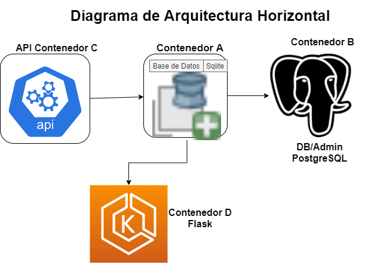

## DAS_SISTEMAS Proyecto Final


	Equipo
- AngelDavid Sena Martinez

- Jorge Luis Lopez Flores

## Descripcion
Contenedores en docker que consumen y ofrecen servicios



### Age of  Empires Base de Datos


### Especificaciones

Aplicacion que recolecta y muestra informacion desde la API 
https://age-of-empires-2-api.herokuapp.com

La información se almacena en una base de datos local usado libreria sqlite3 para creacion de bases de datos 
y tablas.
Se utiliza tecnica ORM usuando la libreria peewee para insertar y mostrar los datos.
-----------------------------------------------------------------------------

### INSTRUCCIONES:

*Verificar si estan instaladas o en el requirement se solicitan los modulos de python tal como python3 en orden
para ejecutarlas:

- flask v.1.1.2
- requests v.2.22.0
- peewee v.3.13.3

Si ya haz instalado los paquetes puedes clonar el repositorio en tu equipo

	$git clone https://github.com/jorgelof/AOE

 ve a la ruta de ubicación de la app:
 
 	cd .../jorgelof/AOE
 	
 Ya en la carpeta puedes verificar que este construida la base de datos "AgeOfEmpiresII.db",
 si no está o deseas volverla a construir puedes eliminar la base de datos existente y correr el siguiente
codigo:

```$python3 dbcreation.py```

o correr el archivo dbcreation.py en tu compilador.

Despues de esto solo corre la app:

	```$python3 app.py```
	
Abre tu navegador e introduce la ruta http://0.0.0.0:5000
podrás ver la pagina de inicio de nuestra app.

### Enlace del video

[Proyecto API] (https://web.microsoftstream.com/video/939a7a1c-e460-407d-a810-5ed4090f4db9?list=studio)